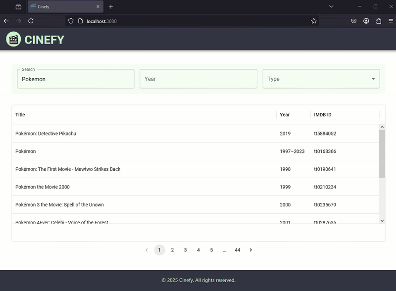

# Cinefy

Cinefy is a React-based web application for exploring movies using the OMDB API. It allows users to search for movies, view details, and navigate through a clean and responsive interface.



---

## Getting Started

### Prerequisites
Before running the project, ensure you have the following installed:
- **Node.js** (v16 or higher)
- **npm** (v7 or higher)

---

### Setting Up the `.env` File
1. Create a `.env` file in the root directory of the project.
2. Add the following environment variable to the file:
   ```properties
   REACT_APP_OMDB_API=http://www.omdbapi.com/?apikey=YOUR_API_KEY
   ```
3. Replace `YOUR_API_KEY` with your OMDB API key. You can generate an API key by signing up at [OMDB API](http://www.omdbapi.com/).

---

### Instructions to Run the Project
1. Clone the repository:
   ```bash
   git clone https://github.com/your-repo/cinefy.git
   ```
2. Navigate to the project directory:
   ```bash
   cd cinefy
   ```
3. Install dependencies:
   ```bash
   npm install
   ```
4. Start the development server:
   ```bash
   npm start
   ```
5. Open your browser and navigate to:
   ```
   http://localhost:3000
   ```

---

## Technologies Used
- **React**: Frontend library for building user interfaces.
- **Redux Toolkit**: State management for handling global application state.
- **TypeScript**: Strongly typed programming language for better code quality.
- **Material-UI (MUI)**: Component library for building a responsive and modern UI.
- **Axios**: HTTP client for making API requests.
- **Sass**: CSS preprocessor for styling.
- **React Router**: For handling navigation and routing.
- **Jest & React Testing Library**: For unit testing components.

---

## Features
- **Search Movies**: Search for movies by title, year, and type.
- **Movie Details**: View detailed information about a selected movie.
- **Responsive Design**: Optimized for both desktop and mobile devices.
- **Pagination**: Navigate through search results with ease.

---

## Notes
- Ensure the `.env` file is not committed to version control by adding it to `.gitignore`.
- For production builds, ensure the API key is securely stored and not exposed in the client-side code.

---

Feel free to contribute to the project or report any issues!